# FibCalc

1. Aplikacja  
   Stworzono aplikację do wyznaczania n-tego elementu ciagu. Wyniki działąnia aplikacji są podane po wykonaniu już kroku drugiego.

   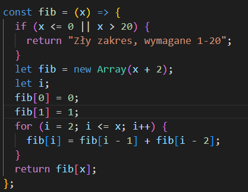

   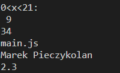

2. Obraz
   Budowa obrazu

```
docker build -t zad:v1 .
```

Uruchomienie kontenera

```
docker run -i -a stdout -a stdin zad:v1
```
Dzięki tej komendzie od razu wykonywana jest aplikacja

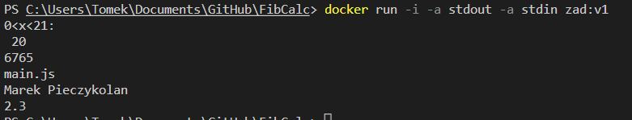

3. fib.yml
   Stworzono fib.yml w .github/workflows, z akcjami github. Wraz ze stworzeniem tego pliku należało stworzyć tokeny aby umożliwić wykonianie wyszystkich akcji takich jak logowanie do dockerhuba, logowanie do ghcr, uzyskanie meta danych, dodanie tagów oraz ścieżki do przechowywanej pamięci podręcznej

   Użyte secrets wykorzystywane są w fib.yml
   
   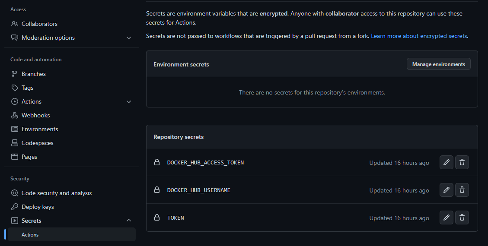
   
   przez

   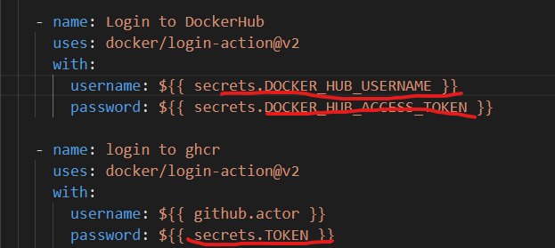

   Token został stworzony dla naszego konta github w opcjach deweloperskich i nadano mu uprawnienia aby mógł wykonać akcje zawarte w fib.yml


4. GH
   Wynik komendy gh workflow list

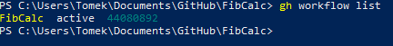

Wykonanie workflowów

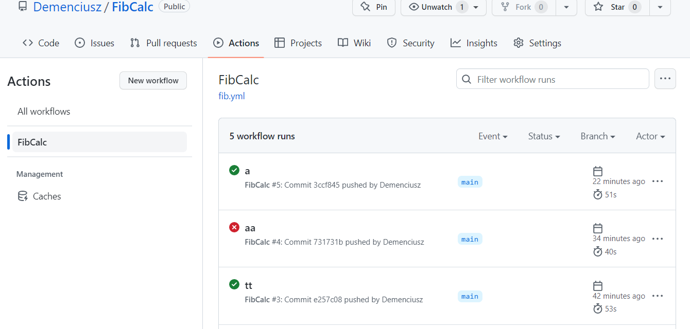

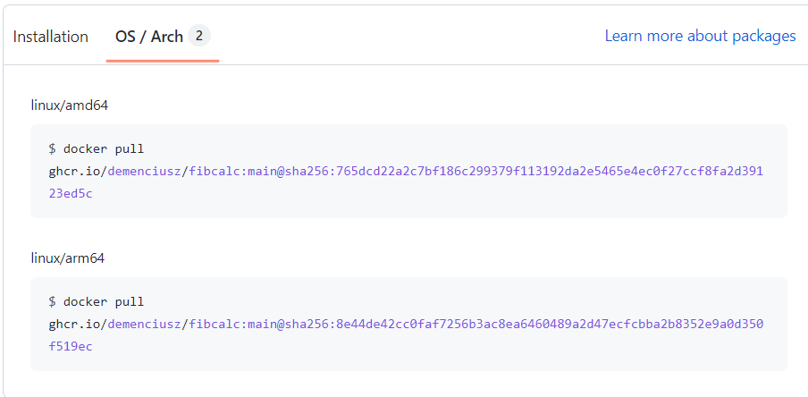

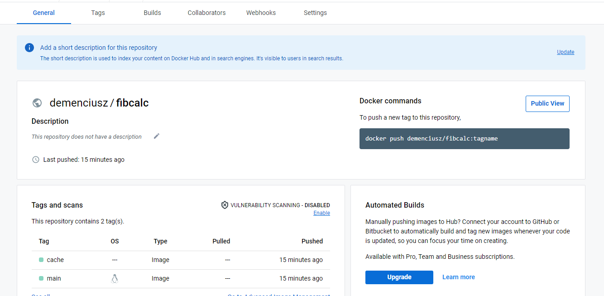

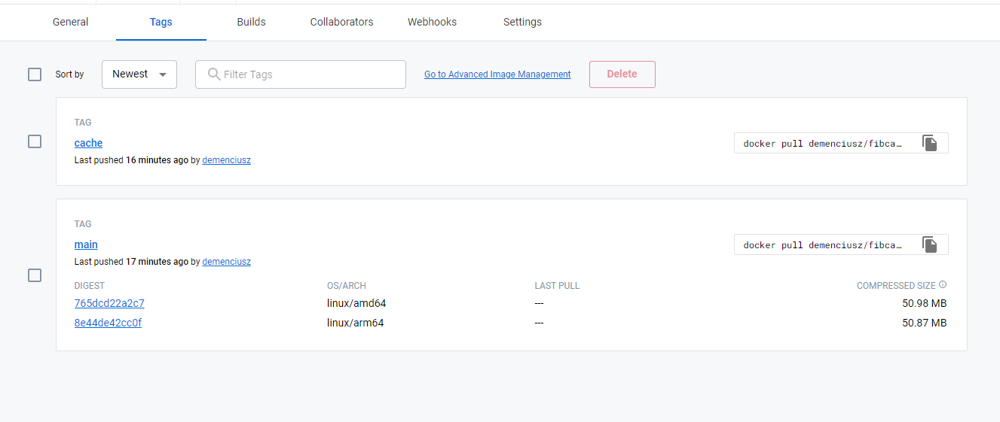

Pull obrazu z repozytorium

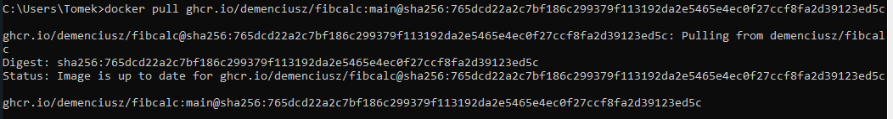

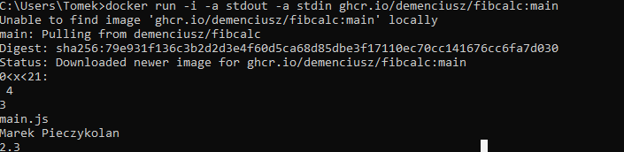
Za drugim razem obraz został pobrany automatycznie gdy nie został znaleziony w folderze
